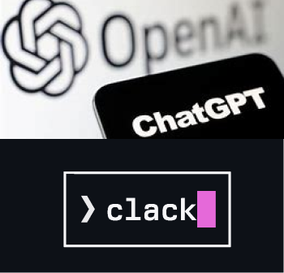
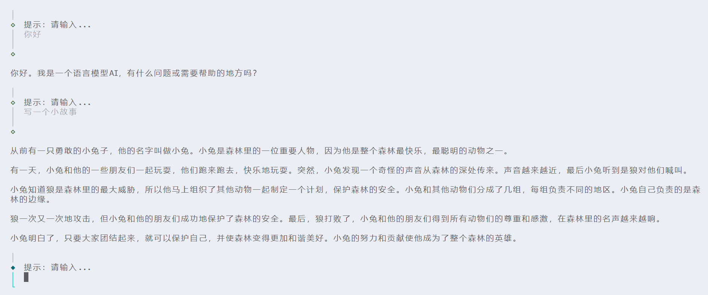

# clack-chat


## 动机

我们有设计一个 cli 能方便的去完成我们的工作，同时 ChatGPT 的 API 命令也是通过能够完成智能通过 prompts 来进行聊天。他们有相同的部分 prompts 提问题。这样或许很有趣~

## 依赖

- ChatGPT （use proxy api）
- @clack/prompts (use text prompts)
- commander (user cli start commander)

## 在本地使用

```sh
npm unlink 

clack-chat start -r '' # -r 是一个 指定一个角色，这里不需要指定 使用 ‘’
```

- 

## 如果你也感兴趣

如果你也感兴趣，不妨 fork，或者给作者提 issues。
